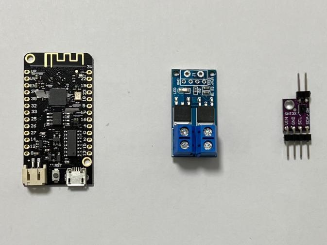

# IoT ESP32 Dehumidifier

This simple application is based on the framework used in [SensorApp](https://github.com/sushenghua/IoT_ESP32_SensorApp) with a recent
update with lib [eps-idf](https://github.com/espressif/esp-idf.git) and removal of [Mongoose Networking](https://github.com/cesanta/mongoose)

### Hardwares
- esp32 chip board
- SHT3x sensor
- PWM amplifier
- fan set

### Running demo and web UI

### Program features
- Self-contained HttpServer, hosting tiny html and js
- OTA service over WebSocket connection

